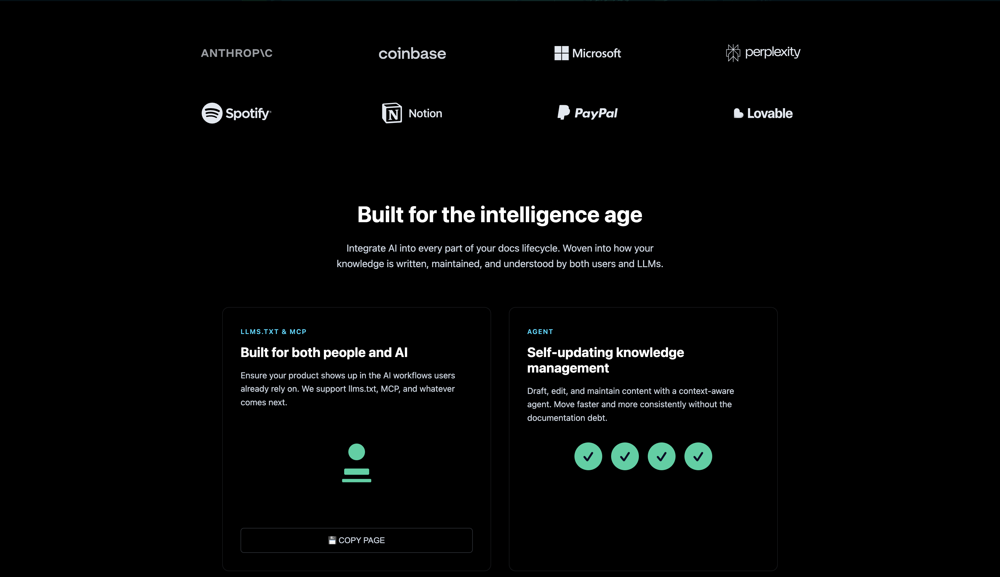
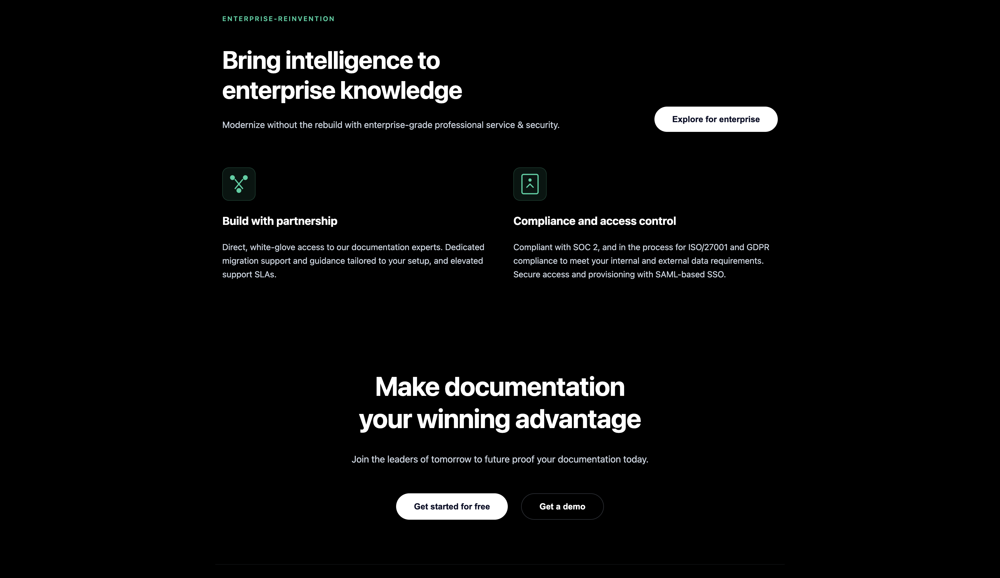
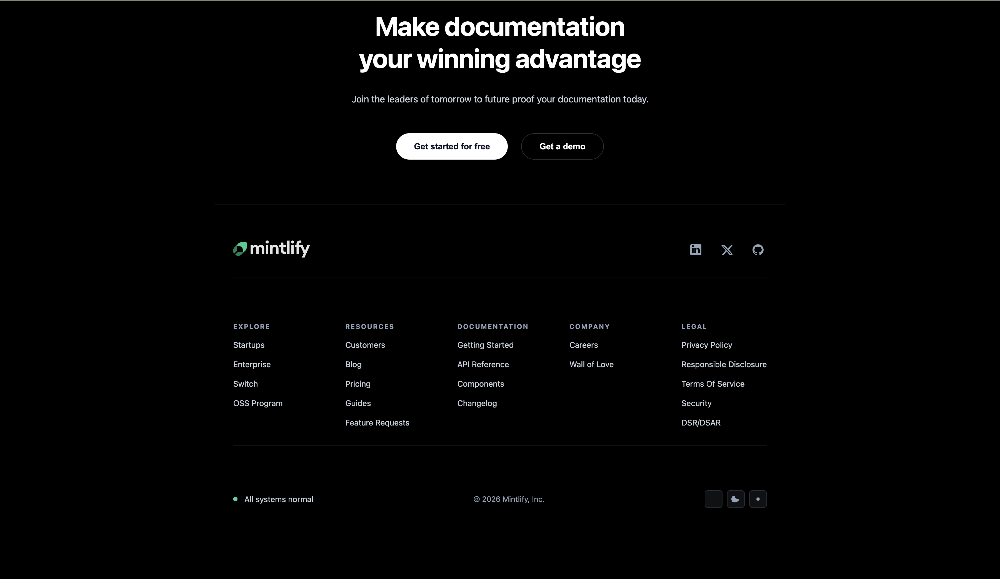

# Mintlify Clone - Landing Page

A simple recreation of the Mintlify landing page using HTML and CSS only.

## 📋 Sections Recreated

1. **Navigation Header** - Logo, menu links, and buttons
2. **Hero Section** - Headline, description, email signup
3. **Trusted By** - Client logos grid
4. **Features** - Feature cards showcase
5. **Intelligent Agent** - Three-column layout with chat interface
6. **Enterprise** - Business solutions cards
7. **Call-to-Action** - Centered text with buttons
8. **Footer** - Links, social icons, and copyright

## 🎨 Design Colors Used

- **Background:** `#0a0e27` (Dark Navy), `#000000` (Black)
- **Accent:** `#1dd1a1` (Teal), `#00d9ff` (Cyan)
- **Text:** `#e2e8f0` (Light), `#cbd5e1` (Medium), `#94a3b8` (Dim)

## 🔤 Fonts Used

- **Font Family:** `system-ui, -apple-system, sans-serif` (System fonts)

## 📸 Screenshots

### Hero Section

### Intelligent Agent Section

### Enterprise Section

### Footer

---
